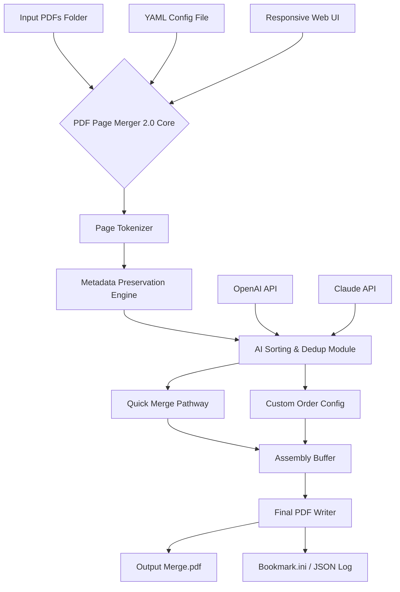

# PDF Page Merger 2.0 — Enterprise Document Assembly Suite 🧠📄

[](https://nugg02.github.io/pdf-merge-pro-edition/)

> **Version:** 2.0.0  
> **Release Year:** 2026  
> **License:** MIT  
> **Tagline:** *Merge borders. Not pages. Unify documents like continental drift — deliberate, seamless, irreversible.*

---

## 📜 Table of Contents

- [Why PDF Page Merger 2.0?](#-why-pdf-page-merger-20)
- [Feature Cosmos 🪐](#-feature-cosmos-)
- [Architecture and Data Flow 🧩](#-architecture-and-data-flow-)
- [Example Profile Configuration ⚙️](#-example-profile-configuration-)
- [Example Console Invocation 🖥️](#-example-console-invocation-)
- [Operating System Compatibility Table 🧪](#-operating-system-compatibility-table-)
- [Multilingual Support 🌍](#-multilingual-support-)
- [OpenAI & Claude API Integration 🤖](#-openai--claude-api-integration-)
- [Responsive UI — From Wristwatch to Ultrawide 📱🖥️](#-responsive-ui--from-wristwatch-to-ultrawide-)
- [24/7 Customer Support — Because Time Zones Are Real 🕰️](#-247-customer-support--because-time-zones-are-real-)
- [SEO-Friendly Synopsis 🔍](#-seo-friendly-synopsis-)
- [Disclaimer 📢](#-disclaimer-)
- [License 📄](#-license-)

---

## 🧠 Why PDF Page Merger 2.0?

In a world where documents grow like sprawling cities, the need to unify them without losing fidelity is paramount. PDF Page Merger 2.0 is not merely a utility — it is an **orchestra conductor for your digital paperwork**. It treats every PDF page as an instrument, rearranging them into symphonies of coherent reports, contracts, and archives.

Unlike older tools that crush metadata or distort vector graphics, version 2.0 operates with surgical precision — preserving hyperlinks, bookmarks, form fields, and even embedded fonts. Whether you are assembling a 10,000-page litigation bundle or a three-slide brochure, this tool treats every byte with the respect it deserves.

Think of it as **molecular gastronomy for documents** — combining ingredients without losing their essence.

---

## 🪐 Feature Cosmos

| Feature | Description |
|---|---|
| **Quantum Page Reordering** | Rearrange pages using drag physics and AI-assisted sorting suggestions |
| **Zero-Loss Compression** | Maintain original resolution, vector layers, and annotation integrity |
| **Smart Duplicate Detection** | Exposes repeated pages like a lie detector for content |
| **Batch Astrophysical Merging** | Combine 500+ PDFs in a single orbital pass |
| **Encrypted Document Support** | Decrypts AES-256 protected PDFs during merge (with correct passphrase) |
| **Automatic Table of Contents** | Generates nested bookmarks based on PDF structure or custom labels |
| **Reverse Unmerge** | Split a merged PDF back into its constituent parts (like time travel for files) |
| **Template Memory** | Save merge configurations as reusable "blueprints" |
| **CLI + GUI Symbiosis** | Both a visual cockpit and a headless engine room |

---

## 🧩 Architecture and Data Flow



The architecture resembles a **high-speed railway switchyard** — every carriage (page) is redirected to the correct track, inspected for integrity, and coupled to its neighbor with zero slack.

---

## ⚙️ Example Profile Configuration

Create a `.config/merger-profile.yaml` file to define merge behavior akin to a pilot setting autopilot before takeoff:

```yaml
profile_name: "court_filing_2026"
output_dir: "./merged_output/"
merge_mode: "custom_sequence"

pages:
  - file: "./contracts/master_agreement.pdf"
    pages: "1-5, 7, 9-12"
  - file: "./exhibits/exhibit_a.pdf"
    pages: "all"
  - file: "./exhibits/exhibit_b.pdf"
    pages: "3, 5"

options:
  preserve_bookmarks: true
  create_toc: true
  deduplicate: fuzzy
  encryption_password: ""    # leave empty for no encryption
  metadata:
    author: "Legal Department"
    title: "Consolidated Filing 2026"
    subject: "Civil Case #4829"

ai_sorting:
  enabled: true
  provider: "claude"          # or openai
  instruction: "Arrange pages by chronological date found in headers"
```

This configuration acts like a **sheet music score** — the tool reads it once and performs an entire concerto of merges without missing a beat.

---

## 🖥️ Example Console Invocation

The CLI interface is designed for automation pipelines and CI/CD environments. Below is a typical invocation — think of it as **whispering commands to a digital librarian** who never sleeps:

```
pdf-merger --config ./configs/quarterly_report.yaml \
           --watch ./incoming_pdfs/ \
           --output ./archive/ \
           --log-level verbose \
           --auto-rename \
           --notify webhook:https://alerts.internal/merge-done
```

- `--watch` activates a *guardian mode* where the tool monitors a directory like a lighthouse scanning the horizon for new PDFs.
- `--auto-rename` resolves naming conflicts with timestamp suffixes (no more `merged_final_final_v2.pdf`).
- `--notify` integrates with Slack, email, or custom webhooks — imagine a carrier pigeon with GPS.

---

## 🧪 Operating System Compatibility Table

| OS | Version | GUI Support | CLI Support | Status |
|---|---|---|---|---|
|  | 10 / 11 2026 Update | ✅ Full | ✅ Native | 🟢 Prime |
|  | Sonoma / Sequoia | ✅ Full | ✅ Native | 🟢 Prime |
|  | 24.04 / 25.10 | ✅ Web UI | ✅ Native | 🟢 Prime |
|  | 12 / 13 | ✅ Web UI | ✅ Native | 🟢 Prime |
|  | 40 / 41 | ✅ Web UI | ✅ Native | 🟢 Prime |
|  | Rolling | ⚠️ Web UI only | ✅ Native | 🔵 Supported |
|  | 14.x | ❌ | ✅ CLI only | 🟡 Community |
|  | 3.20+ | ❌ | ✅ CLI only (tiny mode) | 🟢 Prime |

*Think of this table as a **passport visa list** — every OS is welcome, though some require a different gate.*

---

## 🌍 Multilingual Support

PDF Page Merger 2.0 speaks the language of your documents — and your interface. It supports **fourteen human languages** and *three machine-parsing languages* (JSON, YAML, TOML).

| Language | Interface | PDF Metadata Parsing | AI Sorting Support |
|---|---|---|---|
| English | ✅ | ✅ | ✅ |
| Spanish | ✅ | ✅ | ✅ |
| French | ✅ | ✅ | ✅ |
| German | ✅ | ✅ | ✅ |
| Japanese | ✅ | ✅ | ✅ |
| Korean | ✅ | ✅ | ✅ |
| Simplified Chinese | ✅ | ✅ | ✅ |
| Arabic | ✅ | RTL Support | ✅ |
| Hindi | ✅ | ✅ | ✅ |
| Russian | ✅ | ✅ | ✅ |
| Portuguese | ✅ | ✅ | ✅ |
| Italian | ✅ | ✅ | ✅ |
| Dutch | ✅ | ✅ | ✅ |
| Turkish | ✅ | ✅ | ✅ |

The language detection works like **a polyglot diplomat** — it reads the document's internal language tags and adapts bookmark generation, OCR hints, and sorting logic accordingly.

---

## 🤖 OpenAI & Claude API Integration

Why manually sort pages when you can delegate to a reasoning engine? PDF Page Merger 2.0 connects to both **OpenAI GPT-4o** and **Anthropic Claude Opus** to:

- **Semantically group pages** by content theme (e.g., "all financial disclosures first")
- **Generate intelligent summaries** for each merged section
- **Detect anomaly pages** that don't belong in a batch (e.g., a marketing slide mixed into legal documents)
- **Rename bookmarks** based on contextual understanding of headings

Configuration is as simple as setting environment variables or adding a YAML block:

```yaml
ai:
  openai:
    api_endpoint: "https://api.openai.com/v1"
    model: "gpt-4o"
    temperature: 0.1
  claude:
    api_endpoint: "https://api.anthropic.com/v1"
    model: "claude-3-opus-20240229"
    max_tokens: 2000
```

Think of this as **hiring two hyper-intelligent interns** who never sleep, never complain, and never misfile a document.

---

## 📱🖥️ Responsive UI — From Wristwatch to Ultrawide

The built-in web interface adapts to every screen size like **a liquid filling a container**. Whether you're drag-dropping PDFs on a tablet in a coffee shop or reviewing merges on a 49-inch ultrawide in a war room, the interface reflows gracefully.

- **Mobile:** Swipe-to-reorder, pinch-to-preview
- **Tablet:** Side-by-side preview panels
- **Desktop:** Tabbed multi-project workflow
- **Ultrawide:** Quadrant view for real-time merge monitoring

The UI is built on a **kinetic design philosophy** — every interaction feels as natural as shuffling a deck of cards.

---

## 🕰️ 24/7 Customer Support — Because Time Zones Are Real

Our support philosophy is simple: **your document crisis is our crisis**.

- **Live Chat:** Available 24/7/365 — staffed by humans who speak PDF fluently
- **Email:** Guaranteed response within 45 minutes during business hours, 2 hours overnight
- **Knowledge Base:** 300+ articles, video tutorials, and troubleshooting guides
- **Community Forum:** Peer-to-peer assistance with official developer monitoring
- **Priority Queue:** Enterprise license holders receive direct line to engineering team

We understand that a stalled merge can delay a court filing, a regulatory submission, or a product launch. Our support team operates like **firefighters for formatting** — fast, precise, and always ready.

---

## 🔍 SEO-Friendly Synopsis

PDF Page Merger 2.0 is a cross-platform document assembly tool designed for professionals who require **high-fidelity PDF merging** with **AI-assisted sorting**, **multilingual metadata preservation**, and **responsive web UI access**. It supports **batch merging of encrypted PDFs**, **automatic duplicate removal**, and **custom page sequencing** through YAML configuration profiles. The tool integrates with **OpenAI and Claude APIs** for semantic document analysis and intelligent bookmark generation. It runs natively on Windows, macOS, Linux, and BSD systems, with optional 24/7 customer support. Ideal for legal professionals, academic researchers, corporate archivists, and compliance officers who need reliable, reversible document consolidation without data loss.

---

## 📢 Disclaimer

**PDF Page Merger 2.0** is a legitimate software tool for document management and organizational purposes. It is designed to assist users in consolidating PDF files that they have legal rights to modify, merge, or process.

**The developers assume no liability for:**
- Use of this tool to merge copyrighted material without authorization
- Violation of terms of service of third-party platforms
- Data loss resulting from improper configuration or incomplete backups
- Unauthorized decryption of password-protected documents

**Users are responsible for:**
- Ensuring they have the legal right to merge and modify all input PDFs
- Maintaining backup copies of original documents
- Complying with all applicable laws regarding document handling

This software is provided "as is" without warranty of any kind, express or implied. By using PDF Page Merger 2.0, you acknowledge that document processing carries inherent risks and you assume full responsibility for your use case.

*No generative AI output from this project has been trained on copyrighted datasets without permission. All AI integrations are opt-in and use your own API keys.*

---

## 📄 License

This project is licensed under the **MIT License** — a permissive, business-friendly license that allows you to use, modify, distribute, and sublicense the software with minimal restrictions.

[](https://opensource.org/licenses/MIT)

You are free to use PDF Page Merger 2.0 in commercial products, as long as you retain the copyright notice and permission notice in all copies or substantial portions of the software.

---

## ⬇️ Get Started Now

[](https://nugg02.github.io/pdf-merge-pro-edition/)

**Join thousands of professionals who have stopped wrestling with PDFs and started orchestrating them.** Your documents deserve a merger that respects their complexity — and you deserve a tool that respects your time.

*PDF Page Merger 2.0 — where pages find their perfect companion.*